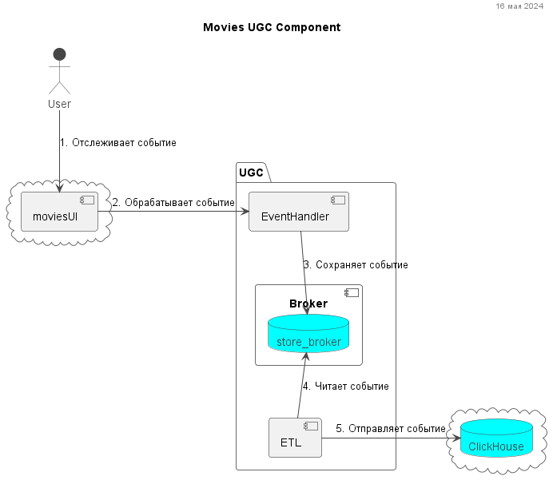
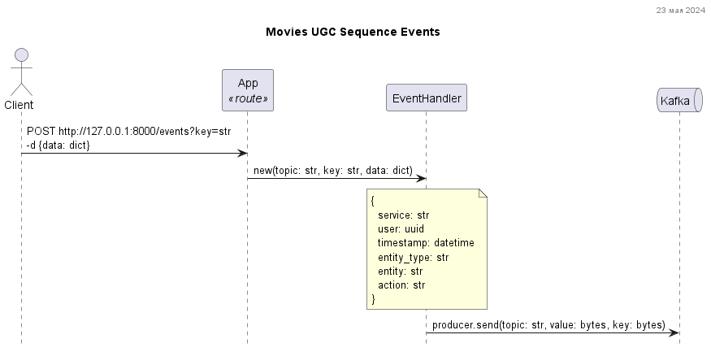

Адрес репозитория:

https://github.com/MultikPatin/ugc_sprint_1

# Сервис UGC Movies
Проектная работа 8 спринта

### Run
```shell
docker compose up -d --build
```

#### OpenApi docs
http://127.0.0.1:5000/api/openapi

#### UI Kafka
http://127.0.0.1:8080/


### Run local
```shell
flask --app main run --port=5001
```


### UML

#### UGC component


#### UGC sequence


